<picture>
  <source media="(prefers-color-scheme: dark)" srcset="assets/banner-dark.svg">
  <source media="(prefers-color-scheme: light)" srcset="assets/banner-light.svg">
  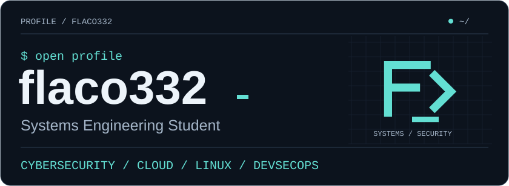
</picture>

[Projects](#-ls-projects) · [Tech stack](#-cat-tech-stackyaml) · [Focus](#-kubectl-get-skills---all-namespaces) · [Connect](#-connect---socials)

## `$ whoami`

<picture>
  <source media="(prefers-color-scheme: dark)" srcset="assets/whoami.svg">
  <source media="(prefers-color-scheme: light)" srcset="assets/whoami-light.svg">
  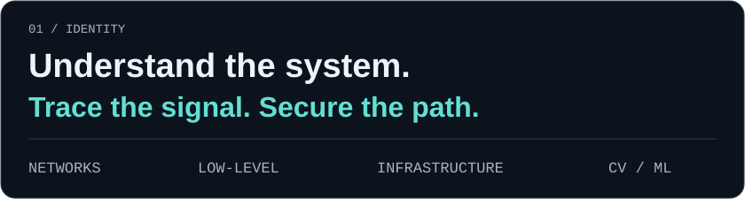
</picture>

I'm a **Systems Engineering Student** focused on **Cybersecurity, Cloud, Linux and DevSecOps**. My interests connect networking and security with systems, low-level programming, and Computer Vision / ML.

I learn through hands-on projects: inspecting network traffic, building terminal tools, and working with local applications and data.

## `$ cat tech-stack.yaml`

<p>
  <picture>
    <source media="(prefers-color-scheme: dark)" srcset="assets/tech-stack-security.svg">
    <source media="(prefers-color-scheme: light)" srcset="assets/tech-stack-security-light.svg">
    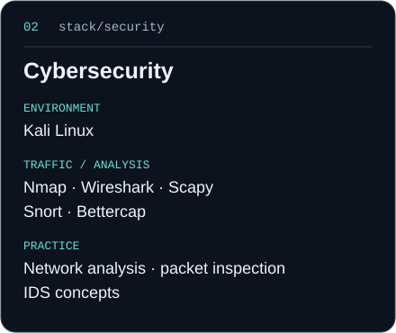
  </picture>
  <picture>
    <source media="(prefers-color-scheme: dark)" srcset="assets/tech-stack-cloud.svg">
    <source media="(prefers-color-scheme: light)" srcset="assets/tech-stack-cloud-light.svg">
    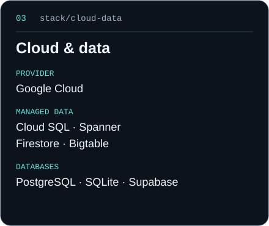
  </picture>
  <picture>
    <source media="(prefers-color-scheme: dark)" srcset="assets/tech-stack-code.svg">
    <source media="(prefers-color-scheme: light)" srcset="assets/tech-stack-code-light.svg">
    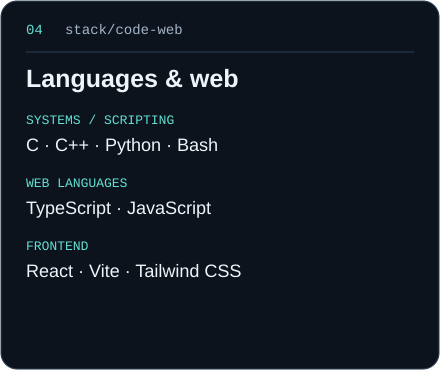
  </picture>
  <picture>
    <source media="(prefers-color-scheme: dark)" srcset="assets/tech-stack-systems.svg">
    <source media="(prefers-color-scheme: light)" srcset="assets/tech-stack-systems-light.svg">
    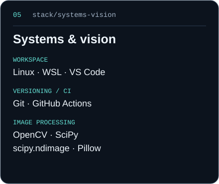
  </picture>
</p>

<details>
<summary>View the stack as YAML</summary>

```yaml
languages:
  - C
  - C++
  - Python
  - TypeScript
  - JavaScript
  - Bash
cybersecurity:
  tools: [Kali Linux, Nmap, Wireshark, Snort, Bettercap, Scapy]
  practice:
    - network analysis
    - packet inspection
    - IDS concepts
cloud:
  provider: Google Cloud
  data: [Cloud SQL, Spanner, Firestore, Bigtable]
databases: [PostgreSQL, SQLite, Supabase]
web: [React, Vite, Tailwind CSS]
computer_vision:
  - OpenCV
  - SciPy
  - scipy.ndimage
  - Pillow
systems: [Linux, Git, GitHub Actions, VS Code, WSL]
```

</details>

## `$ ls projects/`

<p>
  <a href="https://github.com/flaco332/packet-tracer-security">
    <picture>
      <source media="(prefers-color-scheme: dark)" srcset="assets/project-card-packet-tracer-security.svg">
      <source media="(prefers-color-scheme: light)" srcset="assets/project-card-packet-tracer-security-light.svg">
      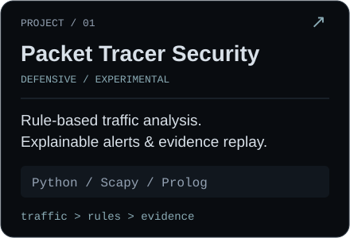
    </picture>
  </a>
  <a href="https://github.com/flaco332/grep-c">
    <picture>
      <source media="(prefers-color-scheme: dark)" srcset="assets/project-card-grep-c.svg">
      <source media="(prefers-color-scheme: light)" srcset="assets/project-card-grep-c-light.svg">
      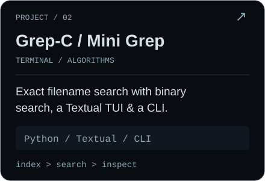
    </picture>
  </a>
  <a href="https://github.com/flaco332/Onca">
    <picture>
      <source media="(prefers-color-scheme: dark)" srcset="assets/project-card-onca.svg">
      <source media="(prefers-color-scheme: light)" srcset="assets/project-card-onca-light.svg">
      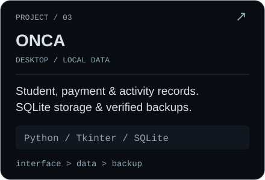
    </picture>
  </a>
</p>

- **[Packet Tracer Security](https://github.com/flaco332/packet-tracer-security)** — experimental defensive traffic analysis with explainable rules and replayable evidence.
- **[Grep-C / Mini Grep](https://github.com/flaco332/grep-c)** — exact filename search with binary search, a terminal UI and a CLI, built in Python.
- **[ONCA](https://github.com/flaco332/Onca)** — local desktop management for students, payments and activities, with SQLite and verified backups.

## `$ kubectl get skills --all-namespaces`

<p>
  <picture>
    <source media="(prefers-color-scheme: dark)" srcset="assets/radar-skills.svg">
    <source media="(prefers-color-scheme: light)" srcset="assets/radar-skills-light.svg">
    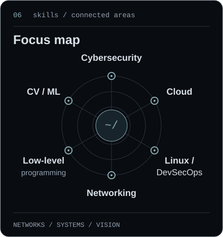
  </picture>
  <picture>
    <source media="(prefers-color-scheme: dark)" srcset="assets/radar-langs.svg">
    <source media="(prefers-color-scheme: light)" srcset="assets/radar-langs-light.svg">
    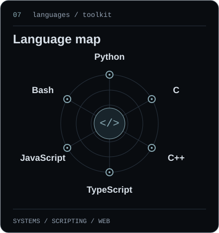
  </picture>
</p>

These maps show **areas of practice and interest**, with equal spokes for every area. They represent coverage, without proficiency scores or usage percentages.

## `$ connect --socials`

**[GitHub](https://github.com/flaco332)** · **[Portfolio](https://flaco332.github.io/carlos-portafolio/)** · **[Telegram](https://t.me/cr0dev)** · **[Email](mailto:crdeveloper@proton.me)**

`github.com/flaco332` · `@cr0dev` · `crdeveloper@proton.me`

---

<details>
<summary><code>$ cat .off-duty</code></summary>

```text
████    ███   ███
█   █    █     █
████     █     █
█   █ █  █  █  █
████   ██    ██
```

Off the terminal, I practice Brazilian Jiu-Jitsu. Stay curious. Keep showing up.

</details>
